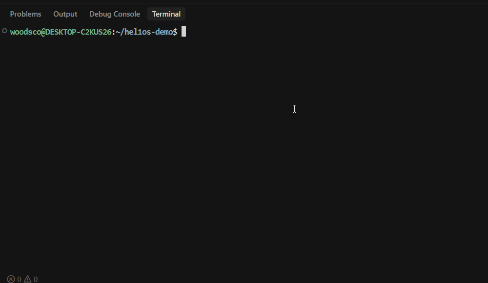

# Continuity

A small CLI experiment in **repository-owned context** for AI coding assistants.

Continuity scaffolds a version-controlled `/ai` directory, helps you keep those files filled in, and assembles them into a plain-text brief you can paste into any chat — or expose over MCP. It does not call AI APIs, run background services, or store data outside your repo.

## Project Status

This is a **completed proof-of-concept / early-stage experiment**, not an actively evolving product. The workflow below works as implemented. Treat it as a portfolio-ready side project exploring a convention (`/ai` beside the code), not as infrastructure for production teams.

## What it implements

| Command | What it does |
| --- | --- |
| `continuity init` | Creates `ai/` with six markdown templates (never overwrites existing files). Optional `-i` pre-fills `PROJECT.md`. |
| `continuity brief` | Reads `ai/` and prints a compact context brief to stdout (`--format json` available). |
| `continuity log` | Appends a structured session entry to `ai/SESSION_LOG.md`. |
| `continuity doctor` | Reports whether each `ai/` file looks missing, empty/placeholder, or filled. Exit code `1` if anything needs attention. |
| `continuity mcp` | Local stdio MCP server with `get_brief`, `get_file`, `log_session`, and `update_file`. |

No cloud, database, auth, telemetry, or web UI.

## Install

Requires Node.js 18+.

```bash
npm install -g @continuityai/cli
```

Or without a global install:

```bash
npx @continuityai/cli init
npx @continuityai/cli brief
```

## Quick start

```bash
cd your-project
continuity init
# edit the files under ai/
continuity brief          # copy into any AI chat
continuity doctor         # optional health check
```

On macOS you can pipe to the clipboard: `continuity brief | pbcopy`.



## The `/ai` directory

```
ai/
  PROJECT.md       # What this project is and why it exists
  ARCHITECTURE.md  # How the system is structured
  TASKS.md         # Active work, backlog, done
  DECISIONS.md     # Key decisions
  AGENT_RULES.md   # How agents should behave in this repo
  SESSION_LOG.md   # Chronological session log
```

These files are meant to be committed. Humans can read them; agents can be given them via `brief` or MCP.

## Commands

### `continuity init`

```bash
continuity init
continuity init -i          # prompt for name, description, stack → pre-fill PROJECT.md
continuity init -d ../other
```

Example (non-interactive):

```
Created directory: /path/to/project/ai
Created file: /path/to/project/ai/PROJECT.md
Created file: /path/to/project/ai/ARCHITECTURE.md
Created file: /path/to/project/ai/DECISIONS.md
Created file: /path/to/project/ai/TASKS.md
Created file: /path/to/project/ai/SESSION_LOG.md
Created file: /path/to/project/ai/AGENT_RULES.md

Continuity initialized successfully.
```

### `continuity brief`

```bash
continuity brief
continuity brief --no-rules
continuity brief --only project,tasks,decisions
continuity brief --format json
continuity brief -d ../other
```

`--only` accepts: `project`, `arch`, `tasks`, `decisions`, `rules`, `log`.

Empty or still-template sections are skipped. For `SESSION_LOG.md`, only the last entry is included.

### `continuity log`

```bash
continuity log \
  --focus "Implemented Redis cache layer" \
  --changes "Created src/cache/redis.ts, updated aggregate endpoint" \
  --decisions "TTL set to 60s based on inverter polling interval" \
  --next "Write load tests for ingestion pipeline"
```

All of `--focus`, `--changes`, `--decisions`, and `--next` are required. Optional: `--date YYYY-MM-DD`, `-d <path>`.

### `continuity doctor`

```bash
continuity doctor
```

Example:

```
continuity doctor

  PROJECT.md          ✓ healthy
  ARCHITECTURE.md     ✓ healthy
  TASKS.md            ✓ healthy
  DECISIONS.md        ✗ empty — contains only placeholder text
  AGENT_RULES.md      ✓ healthy
  SESSION_LOG.md      ✓ healthy

  5 of 6 files healthy

  Fill in empty files to improve brief output quality.
```

### `continuity mcp`

Starts a local MCP server over stdio (useful with Claude Desktop or Cursor).

**Claude Desktop** — add to `~/.claude/claude_desktop_config.json`:

```json
{
  "mcpServers": {
    "continuity": {
      "command": "continuity",
      "args": ["mcp", "--dir", "/path/to/your/project"]
    }
  }
}
```

**Cursor** — add to MCP settings:

```json
{
  "continuity": {
    "command": "continuity",
    "args": ["mcp", "--dir", "/path/to/your/project"]
  }
}
```

Tools exposed: `get_brief`, `get_file`, `log_session`, `update_file`.

## Design notes

Continuity keeps project memory in the repository instead of only in chat transcripts. A README is for humans discovering a project; editor rules are usually tool-specific and style-focused. This experiment asks whether a small, structured `/ai` tree — plus a one-command brief — is enough to make that context portable across assistants.

It is **not** claiming to solve context loss for every team or every tool. It is a concrete, installable sketch of that idea.

## Contributing

See [CONTRIBUTING.md](./CONTRIBUTING.md) for local development. Bug reports via GitHub issues are welcome; there is no active product roadmap.

## License

[MIT](./LICENSE)
